# Thematic Analysis Pipeline Orchestration

## Pipeline Flow

```mermaid
graph LR
    subgraph P1["Phase 1"]
        A1[1. Transcript Analysis] --> A2[2. Open Coding] --> A3[3. Code Evaluation]
    end

    A3 --> G1{{"🛑 Code Review"}}

    subgraph P2["Phase 2"]
        A4[4. Theme Generation] --> A5[5. Theme Evaluation] --> A6[6. POV Generation]
    end

    G1 --> A4
    A6 --> G2{{"🛑 POV Selection"}}

    subgraph P3["Phase 3"]
        A7[7. Recommendation Generation]
    end

    G2 --> A7
    A7 --> G3{{"🛑 Rec Selection"}}

    subgraph P4["Phase 4"]
        A8[8. Report Writing]
    end

    G3 --> A8
    A8 --> DONE([✅ Complete])

    classDef agent fill:#2563eb,color:#fff,stroke:#1d4ed8
    classDef gate fill:#dc2626,color:#fff,stroke:#991b1b
    classDef done fill:#16a34a,color:#fff,stroke:#15803d

    class A1,A2,A3,A4,A5,A6,A7,A8 agent
    class G1,G2,G3 gate
    class DONE done
```

---

## Agent Details

| | **Phase 1** | | | | **Phase 2** | | | | **Phase 3** | | **Phase 4** |
|---|---|---|---|---|---|---|---|---|---|---|---|
| | **Step 1** | **Step 2** | **Step 3** | 🛑 | **Step 4** | **Step 5** | **Step 6** | 🛑 | **Step 7** | 🛑 | **Step 8** |
| | Transcript Analysis | Open Coding | Code Evaluation | Code Review | Theme Generation | Theme Evaluation | POV Generation | POV Selection | Recommendations | Rec Selection | Report Writing |
| **File** | `step1_transcript_agent.py` | `step2_coding_agent.py` | `step3_5_evaluation_agent.py` | — | `step4_theme_agent.py` | `step3_5_evaluation_agent.py` | `step6_pov_agent.py` | — | `step7_recommendation_agent.py` | — | `step8_report_agent.py` |
| **Input** | transcripts, research_brief, screener_questions | quotes, participants, research_brief, screener_questions | codes (with quote counts), research_brief | Human edits codes | codes, quotes, participants, research_brief | themes (with code/quote counts), research_brief | themes (with interpretations), research_brief | Human picks 1 of 3 POVs | selected_pov, themes, quotes, research_brief | Human picks recs to include | All session data |
| **Pattern** | Quote extraction + linguistic validation | Open coding + reflexive bias detection | TAMA framework quality scoring | — | Reflexive thematic analysis + negative case analysis | TAMA framework quality scoring | Multi-perspective analytical framing | — | POV-driven synthesis | — | Braun & Clarke thematic analysis report |
| **Model** | `claude-opus-4-6` | `claude-opus-4-6` | `claude-sonnet-4-20250514` | — | `claude-opus-4-6` | `claude-sonnet-4-20250514` | `claude-opus-4-6` | — | `claude-opus-4-6` | — | `claude-opus-4-6` |
| **Skills** | `step1_quote_extraction.py`: Language detection, participant ID, verbatim quote extraction, preliminary codes, screener data extraction, saturation assessment | `step2_coding_consistency.py`: 2–4 codes/quote, code grouping, screener grouping, bias detection, inter-rater flagging (3–5 quotes) | `step3_5_scoring.py`: Score coverage, actionability, distinctiveness, relevance (1.0–5.0) | Resolve inter-rater candidates, address bias flags | `step4_grounding.py`: Group codes → 3–7 themes, APA literature (2–4 per theme), rich interpretation, grounding verification, negative case analysis, thick description | `step3_5_scoring.py`: Score coverage, actionability, distinctiveness, relevance (1.0–5.0) | 3 distinct analytical lenses, POV coherence, implication clarity, key tension ID | — | 12–15 actionable recs, POV alignment, thematic linking, priority assignment (H/M/L), sequencing | — | Exec summary, methodology, findings, discussion, recs, appendices, block quotes, attribution, lit synthesis, ≥ 3000 words |
| **Validation** | Word count (< 100 flagged), non-ASCII ratio (< 0.7), 50-char prefix accuracy, screener coverage (min 2/group), participant coverage | Jaccard consistency (> 0.4), inter-rater candidates, bias flags, coding summary | Score clamping 1.0–5.0, average quality calc | — | Thin description (< 3 quotes), grounding issues, thematic map, saturation assessment | Score clamping 1.0–5.0 | Max 3 POVs enforced | — | Priority distribution (≥ 3H, 4–5M, 3–4L), implementation notes | — | Pre-write checks (brief ≥ 20 chars, ≥ 5 quotes, ≥ 2 themes, POV selected, ≥ 3 recs), keyword alignment |
| **Output** | quotes, participants, data_saturation, participant_coverage | codes (label, description, quote_ids, group, screener_groups) | codes[].scores, code_evaluation summary | Reviewed codes | themes (name, description, code_ids, literature_support, interpretation, contradictory_quotes) | themes[].scores, theme_evaluation summary | povs (title, description, rationale, supporting_themes) | selected_pov | recommendations (text, supporting_theme, priority) | selected recommendations | report (markdown string) |
